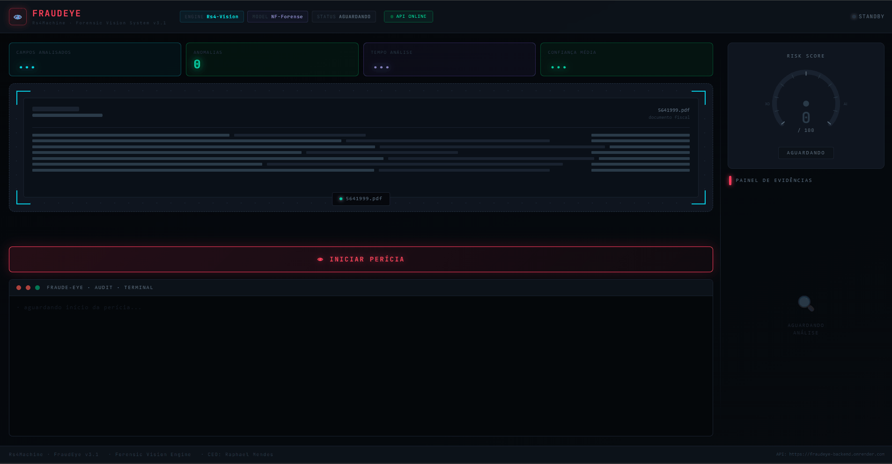

<div align="center">
  
  <h1>🔍 FraudEye — Rs4Machine</h1>
  
  <p><strong>Forensic analysis system for Brazilian fiscal documents (NF-e)</strong></p>
  <p>Deterministic validation and evidence-based fraud assessment for operational review.</p>
  <p>
    <a href="https://fraudeye-frontend.vercel.app/fraud-eye" target="_blank"><strong>🚀 Live App</strong></a> •
    <a href="https://fraudeye-backend.onrender.com/docs" target="_blank"><strong>📡 API Docs</strong></a> •
    <a href="https://github.com/raphaelmendes-dev"><strong>GitHub</strong></a>
  </p>
  <p><em>README in <a href="README.pt-BR.md">Português</a></em></p>
</div>

---

## 🎯 Overview

**FraudEye** is a forensic analysis system for Brazilian fiscal documents (NF-e / DANFE). It combines PDF extraction, deterministic validation rules, and evidence-oriented classification to support human review in high-risk operational contexts.

The system is intentionally constrained to measurable logic: it validates known failure patterns, exposes the evidence behind each decision, and avoids opaque generative behavior.

This is consistent with the RS4 Lab principle that a human remains the final decision-maker and that every critical decision must be auditable.

---

## 🏗️ Architecture

```text
fraudeye/
├── frontend/                        → Next.js 16 (Vercel)
│   └── app/
│       ├── fraud-eye/
│       │   └── page.jsx             → Main orchestrator
│       ├── components/FraudEye/
│       │   ├── RiskMeter.jsx
│       │   ├── DropZone.jsx
│       │   ├── EvidenceCard.jsx
│       │   ├── AuditTerminal.jsx
│       │   ├── MetricPills.jsx
│       │   └── VerdictPanel.jsx
│       ├── hooks/
│       │   └── useFraudAnalysis.js
│       ├── constants/
│       │   └── tokens.js            → Rs4Machine design tokens
│       └── styles/
│           └── fraudeye.css
└── backend/                         → Python + FastAPI (Render)
    ├── api.py                       → Main endpoints
    ├── requirements.txt
    └── core/
        ├── validators.py            → Anti-fraud logic
        └── scorer.py                → Risk Score calculation
```

---

## ✨ Features

- PDF upload (NF-e / DANFE / contracts)
- Text extraction with `pdfplumber`
- Deterministic validations:
  - CNPJ/CPF — official check digit
  - Retroactive or suspicious dates
  - Missing NF-e key (44 digits)
  - Sum inconsistency (items vs total)
- Risk score 0–100 with animated gauge
- Evidence panel with severity levels (critical / high / medium / low)
- Real-time audit terminal logs
- Automatic forensic report

---

## 🛠️ Tech Stack

| Layer | Technology |
|---|---|
| Frontend | Next.js 16 + React |
| Styling | CSS-in-JS + Rs4Machine design tokens |
| Backend | Python 3.12+ + FastAPI + uvicorn |
| Extraction | pdfplumber |
| Validation | re, unicodedata, pandas |
| Frontend Deploy | Vercel |
| Backend Deploy | Render |

---

## 🚀 Running Locally

### Backend

```bash
cd backend
python -m venv venv
venv\Scripts\activate      # Windows
pip install -r requirements.txt
uvicorn api:app --reload
```

API available at: `http://localhost:8000/docs`

### Frontend

```bash
cd frontend
npm install
npm run dev
```

App available at: `http://localhost:3000/fraud-eye`

> Run both terminals simultaneously.

---

## 📡 API Endpoints

| Method | Route | Description |
|---|---|---|
| GET | `/` | Health check |
| GET | `/health` | API status |
| POST | `/analyze` | PDF document analysis |

---

## 📬 Contact

**Raphael Mendes**  
**AI Systems Engineer & Founder · Rs4Machine**

- 📧 [python.dev.raphael@gmail.com](mailto:python.dev.raphael@gmail.com)
- 🔗 [LinkedIn](https://www.linkedin.com/in/raphaelmendes-dev/)
- 🌐 [Portfolio](https://portfolio-modular-rs4-machine.vercel.app/)

---

⭐ Star this repository if it helped you.

*Last updated: September 2026*
