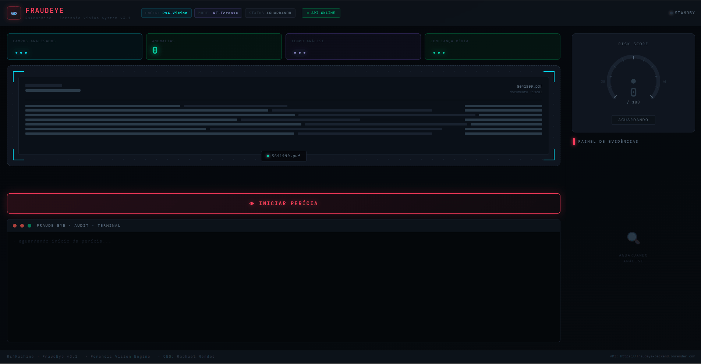

[](https://fraudeye-frontend.vercel.app/fraud-eye)
[](https://www.python.org/)
[](https://fraudeye-backend.onrender.com/docs)
[](https://fraudeye-frontend.vercel.app/fraud-eye)
[](https://fraudeye-frontend.vercel.app/fraud-eye)
[](https://fraudeye-backend.onrender.com/docs)
[](LICENSE)

<div align="center">
  
  <h1>🔍 FraudEye — Rs4Machine</h1>
  
  <p><strong>Forensic Vision System v3.1</strong></p>
  <p>Detecção de fraudes em tempo real para documentos fiscais brasileiros (NF-e).</p>
  <p>
    <a href="https://fraudeye-frontend.vercel.app/fraud-eye" target="_blank"><strong>🚀 App Online</strong></a> •
    <a href="https://fraudeye-backend.onrender.com/docs" target="_blank"><strong>📡 API Docs</strong></a> •
    <a href="https://github.com/raphaelmendes-dev"><strong>GitHub</strong></a> •
    <a href="mailto:python.dev.raphael@gmail.com">Contato</a>
  </p>
  <p><em>README in <a href="README.md">English</a></em></p>
</div>

---

## 🎯 Visão Geral

O **FraudEye** é um sistema de perícia forense para documentos fiscais brasileiros (NF-e / DANFE). Combina extração inteligente de PDF com regras determinísticas de validação e uma interface de missão crítica desenvolvida pela **Rs4Machine**.

- 🔎 Análise forense de NF-e em segundos
- 🧠 Regras determinísticas (sem alucinações de IA generativa)
- 📊 Risk Score visual em tempo real
- 🖥️ Interface estilo terminal com painel de evidências

---

## 🏗️ Arquitetura

```
fraudeye/
├── frontend/                        → Next.js 16 (Vercel)
│   └── app/
│       ├── fraud-eye/
│       │   └── page.jsx             → Orquestrador principal
│       ├── components/FraudEye/
│       │   ├── RiskMeter.jsx
│       │   ├── DropZone.jsx
│       │   ├── EvidenceCard.jsx
│       │   ├── AuditTerminal.jsx
│       │   ├── MetricPills.jsx
│       │   └── VerdictPanel.jsx
│       ├── hooks/
│       │   └── useFraudAnalysis.js
│       ├── constants/
│       │   └── tokens.js            → Design DNA Rs4Machine
│       └── styles/
│           └── fraudeye.css
└── backend/                         → Python + FastAPI (Render)
    ├── api.py                       → Endpoints principais
    ├── requirements.txt
    └── core/
        ├── validators.py            → Regras antifraude
        └── scorer.py                → Cálculo do Risk Score
```

---

## ✨ Funcionalidades

- Upload de PDF (NF-e / DANFE / Contratos)
- Extração de texto com pdfplumber
- Validações determinísticas:
  - CNPJ/CPF — dígito verificador oficial
  - Datas retroativas ou suspeitas
  - Chave NF-e ausente (44 dígitos)
  - Inconsistência de soma (itens vs total)
- Risk Score 0–100 com gauge animado
- Painel de Evidências com severidade (critical / high / medium / low)
- Audit Terminal com logs em tempo real
- Laudo pericial automático

---

## 🛠️ Stack Técnica

| Camada          | Tecnologia                           |
|-----------------|--------------------------------------|
| Frontend        | Next.js 16 + React                   |
| Estilo          | CSS-in-JS + Design Tokens Rs4Machine |
| Backend         | Python 3.12+ + FastAPI + uvicorn     |
| Extração        | pdfplumber                           |
| Validação       | re, unicodedata, pandas              |
| Deploy Frontend | Vercel                               |
| Deploy Backend  | Render                               |

---

## 🚀 Como Rodar Localmente

### Backend
```bash
cd backend
python -m venv venv
venv\Scripts\activate      # Windows
pip install -r requirements.txt
uvicorn api:app --reload
```
API disponível em: `http://localhost:8000/docs`

### Frontend
```bash
cd frontend
npm install
npm run dev
```
App disponível em: `http://localhost:3000/fraud-eye`

> ⚠️ Rode os dois terminais ao mesmo tempo.

---

## 📡 Endpoints da API

| Método | Rota       | Descrição                  |
|--------|------------|----------------------------|
| GET    | `/`        | Health check               |
| GET    | `/health`  | Status da API              |
| POST   | `/analyze` | Análise de documento PDF   |

---

## 🤝 Contato

**Rs4Machine** — AI Research Lab  
**Founder / Lead Engineer:** Raphael Mendes  

📧 [python.dev.raphael@gmail.com](mailto:python.dev.raphael@gmail.com)  
🔗 [github.com/raphaelmendes-dev](https://github.com/raphaelmendes-dev)

---

⭐ Dê uma estrela se o projeto te ajudou!

*Última atualização: Setembro 2026*
